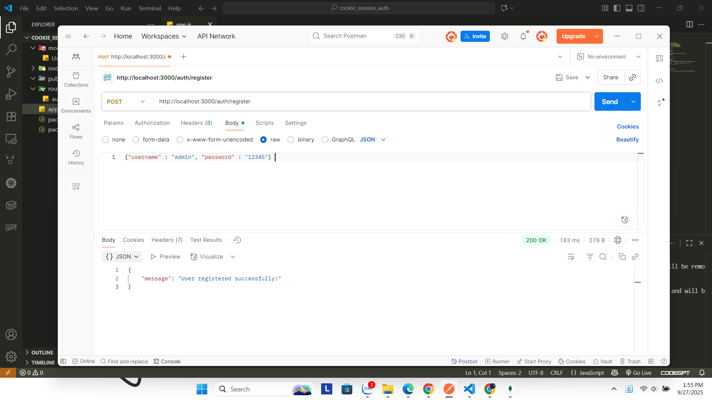
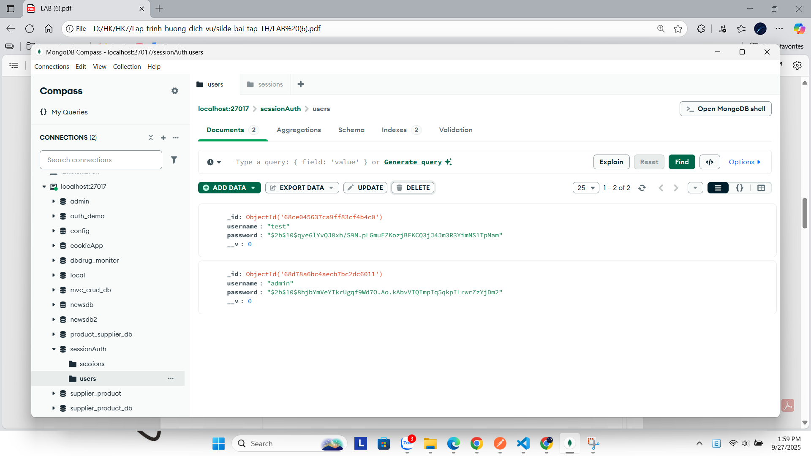
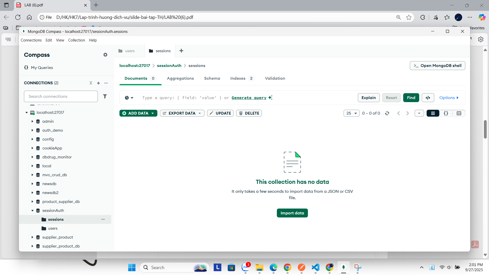
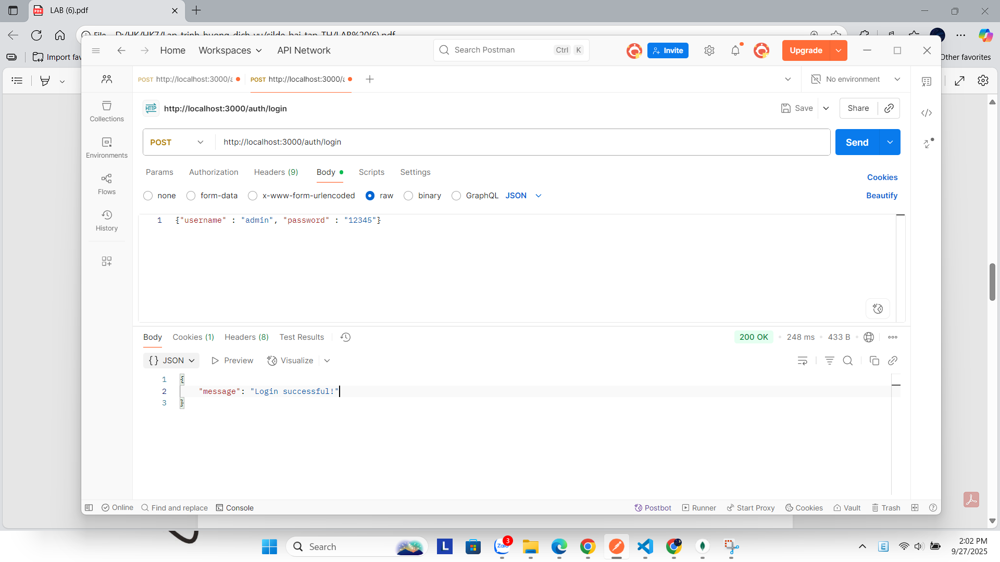
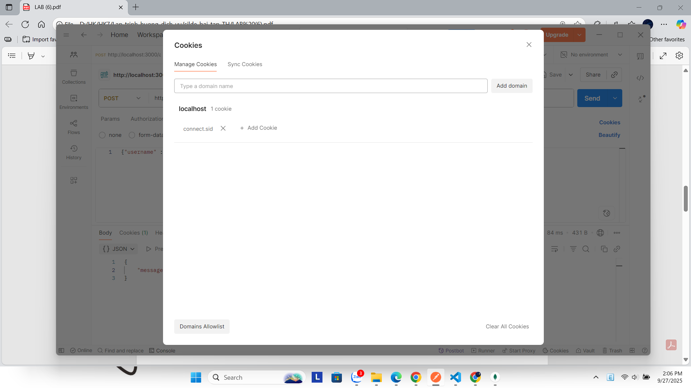
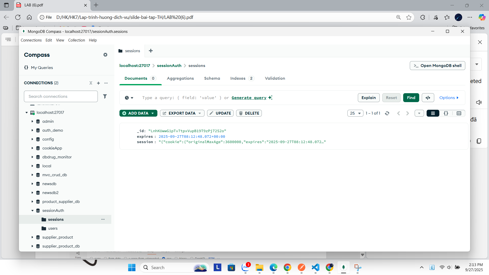
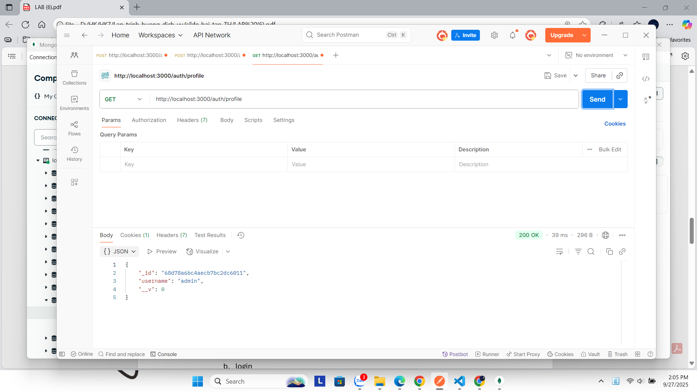
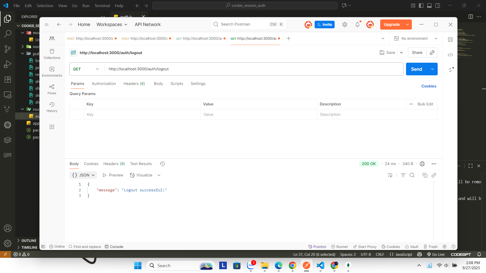
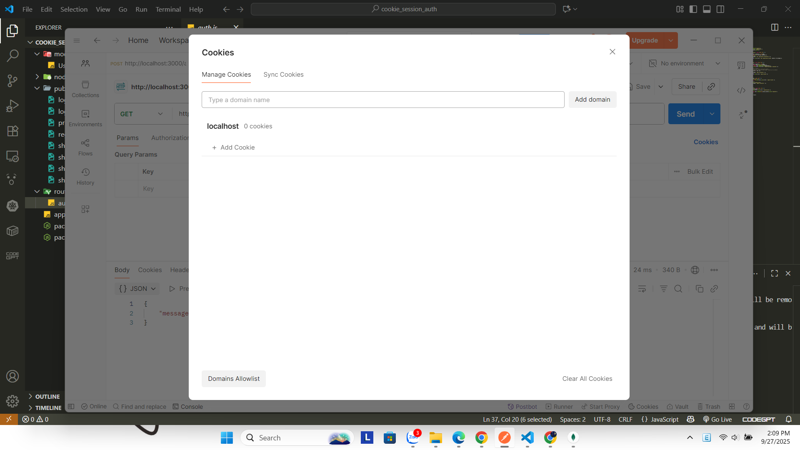
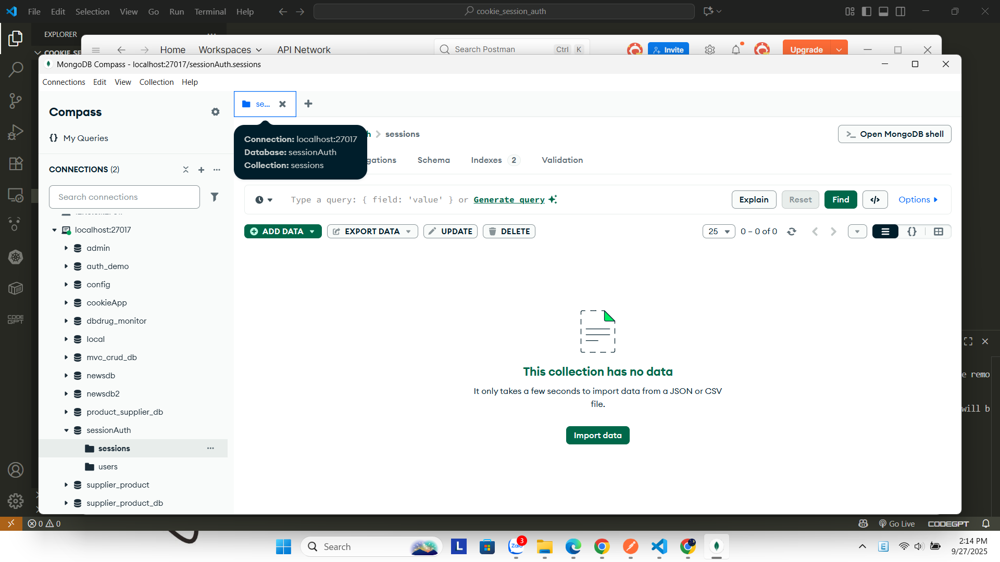

# Cookie Session Authentication

This project demonstrates how to implement authentication using **Express-session** and cookies.  
It includes features: **Register, Login, Protected Route (Profile), and Logout**.

---

## Test Results

### 1. Register
- API: `POST /register`
- Mô tả: Tạo user mới, lưu vào MongoDB.
- Kết quả:



#### Show in MongoDB (Users collection)


#### Show Session (MongoDB - after Register)


---

### 2. Login
- API: `POST /login`
- Mô tả: Đăng nhập với username/password đúng → tạo session và set cookie `connect.sid`.
- Kết quả:



#### Cookie sau khi login


#### Show Session (MongoDB - after Login)


---

### 3. Profile (Protected Route)
- API: `GET /profile`
- Mô tả: Truy cập tài nguyên cần xác thực bằng session cookie.
- Kết quả:



---

### 4. Logout
- API: `GET /logout`
- Mô tả: Hủy session, xóa cookie `connect.sid`.
- Kết quả:



#### Cookie sau khi logout


#### Show Session (MongoDB - after Logout)


---

## How to Run

1. Cài đặt dependencies:
   ```bash
   npm install
2. Chạy app
   ```bash
   node app.js
4. Server chạy tại
   ```bash
   http://localhost:3000
